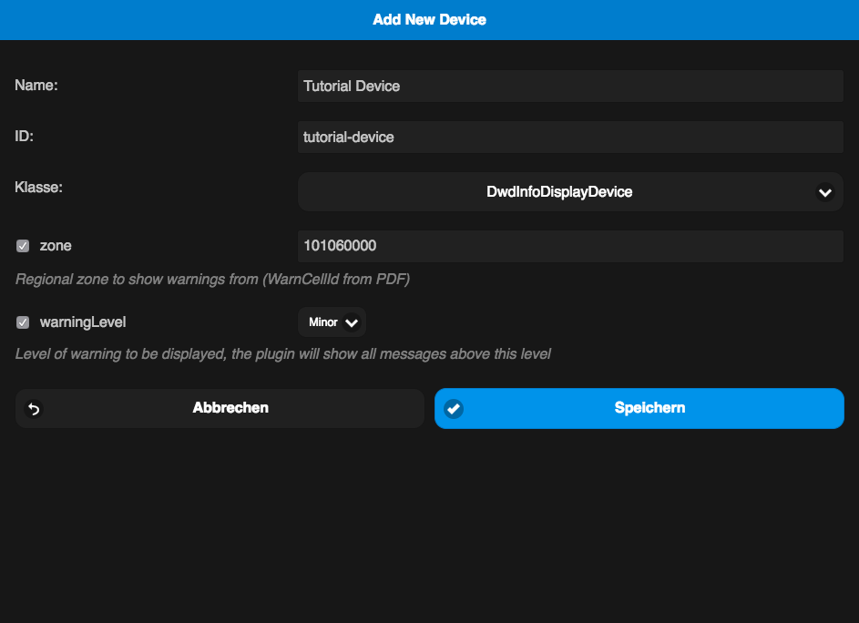

pimatic-dwd
=======================

Pimatic plugin to show weather informations form the ["Deutscher Wetter Dienst"](http://www.dwd.de/).

The informations where only available in german from the DWD so the output is only in german.

At the moment the software is at a development stage so please use it with caution.

The owner of the data and the copyright holder is the ["Deutscher Wetter Dienst"](http://www.dwd.de/).

Copyright Link: 

[http://www.dwd.de/DE/service/copyright/copyright_node.html](http://www.dwd.de/DE/service/copyright/copyright_node.html)

### Sponsoring

Do you like this plugin? Then please consider a donation to support the development.

Information
---------

Because of the support ending for pimatic 0.8.x, we from now on support only pimatic > 0.9.x !

The resolution of the data is NOT on city level but rather on district/county level, because you have to pay the DWD for a finer resolution.

Here you you can find some additional data about the data source: ["Data object description"](http://www.dwd.de/DE/wetter/warnungen_aktuell/objekt_einbindung/objekteinbindung.html?nn=508722#doc582840bodyText9)

The Data form the DWD where updated on there servers every 10 minutes.

Usage
---------

The usage of this plugin is quite easy.

After you installed the plugin over pimatic please restart pimatic !

After that you add a new device of the type "DwdInfoDisplayDevice" over the device manager in pimatic.

You need to select the nearest zone id from the [PDF](doc/ZoneIds.pdf) file or the list below and add this to your device config and select the lowest level of informations you want to show.

If you get an error after the first install, or the device is not showing up in the backend, please clear your browser cache so that pimatic renders the newest templates !

Here is an example:

Changelog
---------------

0.1.0 First working release without Rule support
0.1.1 updated readme

ToDo
---------------

- Add support for the DWD Info Maps
- Add Rule support

ZoneIDs
---------------

| ZoneId    | RegionName                                                      | 
|-----------|-----------------------------------------------------------------| 
| 101001000 | Stadt Flensburg                                                 | 
| 101002000 | Stadt Kiel                                                      | 
| 101003000 | Hansestadt Lübeck                                               | 
| 101004000 | Stadt Neumünster                                                | 
| 101053000 | Kreis Herzogtum Lauenburg                                       | 
| 101060000 | Kreis Segeberg                                                  | 
| 101061000 | Kreis Steinburg                                                 | 
| 101062000 | Kreis Stormarn                                                  | 
| 102000000 | Hansestadt Hamburg                                              | 
| 103101000 | Stadt Braunschweig                                              | 
| 103102000 | Stadt Salzgitter                                                | 
| 103103000 | Stadt Wolfsburg                                                 | 
| 103151000 | Kreis Gifhorn                                                   | 
| 103152000 | Kreis und Stadt Göttingen                                       | 
| 103153000 | Kreis Goslar                                                    | 
| 103154000 | Kreis Helmstedt                                                 | 
| 103155000 | Kreis Northeim                                                  | 
| 103156000 | Kreis Osterode am Harz                                          | 
| 103157000 | Kreis Peine                                                     | 
| 103158000 | Kreis Wolfenbüttel                                              | 
| 103241000 | Region Hannover                                                 | 
| 103251000 | Kreis Diepholz                                                  | 
| 103252000 | Kreis Hameln-Pyrmont                                            | 
| 103254000 | Kreis Hildesheim                                                | 
| 103255000 | Kreis Holzminden                                                | 
| 103256000 | Kreis Nienburg                                                  | 
| 103257000 | Kreis Schaumburg                                                | 
| 103351000 | Kreis Celle                                                     | 
| 103353000 | Kreis Harburg                                                   | 
| 103354000 | Kreis Lüchow-Dannenberg                                         | 
| 103355000 | Kreis Lüneburg                                                  | 
| 103356000 | Kreis Osterholz                                                 | 
| 103357000 | Kreis Rotenburg (Wümme)                                         | 
| 103358000 | Heidekreis                                                      | 
| 103359000 | Kreis Stade                                                     | 
| 103360000 | Kreis Uelzen                                                    | 
| 103361000 | Kreis Verden                                                    | 
| 103401000 | Stadt Delmenhorst                                               | 
| 103402000 | Stadt Emden                                                     | 
| 103405000 | Stadt Wilhelmshaven                                             | 
| 103451000 | Kreis Ammerland                                                 | 
| 103453000 | Kreis Cloppenburg                                               | 
| 103454000 | Kreis Emsland                                                   | 
| 103456000 | Kreis Grafschaft Bentheim                                       | 
| 903458999 | Kreis und Stadt Oldenburg                                       | 
| 903459999 | Kreis und Stadt Osnabrück                                       | 
| 103460000 | Kreis Vechta                                                    | 
| 104011000 | Hansestadt Bremen                                               | 
| 104012000 | Stadt Bremerhaven                                               | 
| 105111000 | Stadt Düsseldorf                                                | 
| 105112000 | Stadt Duisburg                                                  | 
| 105113000 | Stadt Essen                                                     | 
| 105114000 | Stadt Krefeld                                                   | 
| 105116000 | Stadt Mönchengladbach                                           | 
| 105117000 | Stadt Mülheim an der Ruhr                                       | 
| 105119000 | Stadt Oberhausen                                                | 
| 105120000 | Stadt Remscheid                                                 | 
| 105122000 | Stadt Solingen                                                  | 
| 105124000 | Stadt Wuppertal                                                 | 
| 105154000 | Kreis Kleve                                                     | 
| 105158000 | Kreis Mettmann                                                  | 
| 105162000 | Rhein-Kreis Neuss                                               | 
| 105166000 | Kreis Viersen                                                   | 
| 105170000 | Kreis Wesel                                                     | 
| 105314000 | Bundesstadt Bonn                                                | 
| 105315000 | Stadt Köln                                                      | 
| 105316000 | Stadt Leverkusen                                                | 
| 105354000 | StädteRegion Aachen                                             | 
| 105358000 | Kreis Düren                                                     | 
| 105362000 | Rhein-Erft-Kreis                                                | 
| 105366000 | Kreis Euskirchen                                                | 
| 105370000 | Kreis Heinsberg                                                 | 
| 105374000 | Oberbergischer Kreis                                            | 
| 105378000 | Rheinisch-Bergischer Kreis                                      | 
| 105382000 | Rhein-Sieg-Kreis                                                | 
| 105512000 | Stadt Bottrop                                                   | 
| 105513000 | Stadt Gelsenkirchen                                             | 
| 105515000 | Stadt Münster                                                   | 
| 105554000 | Kreis Borken                                                    | 
| 105558000 | Kreis Coesfeld                                                  | 
| 105562000 | Kreis Recklinghausen                                            | 
| 105566000 | Kreis Steinfurt                                                 | 
| 105570000 | Kreis Warendorf                                                 | 
| 105711000 | Stadt Bielefeld                                                 | 
| 105754000 | Kreis Gütersloh                                                 | 
| 105758000 | Kreis Herford                                                   | 
| 105762000 | Kreis Höxter                                                    | 
| 105766000 | Kreis Lippe                                                     | 
| 105770000 | Kreis Minden-Lübbecke                                           | 
| 105774000 | Kreis Paderborn                                                 | 
| 105911000 | Stadt Bochum                                                    | 
| 105913000 | Stadt Dortmund                                                  | 
| 105914000 | Stadt Hagen                                                     | 
| 105915000 | Kreis Hamm                                                      | 
| 105916000 | Stadt Herne                                                     | 
| 105954000 | Ennepe-Ruhr-Kreis                                               | 
| 105958000 | Hochsauerlandkreis                                              | 
| 105962000 | Märkischer Kreis                                                | 
| 105966000 | Kreis Olpe                                                      | 
| 105970000 | Kreis Siegen-Wittgenstein                                       | 
| 105974000 | Kreis Soest                                                     | 
| 105978000 | Kreis Unna                                                      | 
| 106412000 | Stadt Frankfurt am Main                                         | 
| 106414000 | Stadt Wiesbaden                                                 | 
| 106431000 | Kreis Bergstraße                                                | 
| 906432999 | Kreis Darmstadt-Dieburg und Stadt Darmstadt                     | 
| 106433000 | Kreis Groß-Gerau                                                | 
| 106434000 | Hochtaunuskreis                                                 | 
| 106435000 | Main-Kinzig-Kreis und Stadt Hanau                               | 
| 106436000 | Main-Taunus-Kreis                                               | 
| 106437000 | Odenwaldkreis                                                   | 
| 906438999 | Kreis und Stadt Offenbach                                       | 
| 106439000 | Rheingau-Taunus-Kreis                                           | 
| 106440000 | Wetteraukreis                                                   | 
| 106531000 | Kreis Gießen                                                    | 
| 106532000 | Lahn-Dill-Kreis                                                 | 
| 106533000 | Kreis Limburg-Weilburg                                          | 
| 106534000 | Kreis Marburg-Biedenkopf                                        | 
| 106535000 | Vogelsbergkreis                                                 | 
| 106631000 | Kreis Fulda                                                     | 
| 106632000 | Kreis Hersfeld-Rotenburg                                        | 
| 906633999 | Kreis und Stadt Kassel                                          | 
| 106634000 | Schwalm-Eder-Kreis                                              | 
| 106635000 | Kreis Waldeck-Frankenberg                                       | 
| 106636000 | Werra-Meissner-Kreis                                            | 
| 107111000 | Stadt Koblenz                                                   | 
| 107131000 | Kreis Ahrweiler                                                 | 
| 107132000 | Kreis Altenkirchen                                              | 
| 107133000 | Kreis Bad Kreuznach                                             | 
| 107134000 | Kreis Birkenfeld                                                | 
| 107135000 | Kreis Cochem-Zell                                               | 
| 107137000 | Kreis Mayen-Koblenz                                             | 
| 107138000 | Kreis Neuwied                                                   | 
| 107140000 | Rhein-Hunsrück-Kreis                                            | 
| 107141000 | Rhein-Lahn-Kreis                                                | 
| 107143000 | Westerwaldkreis                                                 | 
| 107231000 | Kreis Bernkastel-Wittlich                                       | 
| 107232000 | Eifelkreis Bitburg-Prüm                                         | 
| 107233000 | Kreis Vulkaneifel                                               | 
| 907235999 | Kreis Trier-Saarburg und Stadt Trier                            | 
| 107311000 | Stadt Frankenthal                                               | 
| 107313000 | Stadt Landau in der Pfalz                                       | 
| 107316000 | Stadt Neustadt an der Weinstraße                                | 
| 107318000 | Stadt Speyer                                                    | 
| 107319000 | Stadt Worms                                                     | 
| 107320000 | Stadt Zweibrücken                                               | 
| 107331000 | Kreis Alzey-Worms                                               | 
| 107332000 | Kreis Bad Dürkheim                                              | 
| 107333000 | Donnersbergkreis                                                | 
| 107334000 | Kreis Germersheim                                               | 
| 907335999 | Kreis und Stadt Kaiserslautern                                  | 
| 107336000 | Kreis Kusel                                                     | 
| 107337000 | Kreis Südliche Weinstraße                                       | 
| 907338999 | Rhein-Pfalz-Kreis und Stadt Ludwigshafen                        | 
| 907339999 | Kreis Mainz-Bingen und Stadt Mainz                              | 
| 907340999 | Kreis Südwestpfalz und Stadt Pirmasens                          | 
| 108111000 | Stadt Stuttgart                                                 | 
| 108115000 | Kreis Böblingen                                                 | 
| 108116000 | Kreis Esslingen                                                 | 
| 108117000 | Kreis Göppingen                                                 | 
| 108118000 | Kreis Ludwigsburg                                               | 
| 108119000 | Rems-Murr-Kreis                                                 | 
| 908125999 | Kreis und Stadt Heilbronn                                       | 
| 108126000 | Hohenlohekreis                                                  | 
| 108127000 | Kreis Schwäbisch Hall                                           | 
| 108128000 | Main-Tauber-Kreis                                               | 
| 108135000 | Kreis Heidenheim                                                | 
| 108136000 | Ostalbkreis                                                     | 
| 108211000 | Stadt Baden-Baden                                               | 
| 908215999 | Kreis und Stadt Karlsruhe                                       | 
| 108216000 | Kreis Rastatt                                                   | 
| 108222000 | Stadt Mannheim                                                  | 
| 108225000 | Neckar-Odenwald-Kreis                                           | 
| 908226999 | Rhein-Neckar-Kreis und Stadt Heidelberg                         | 
| 108235000 | Kreis Calw                                                      | 
| 908236999 | Enzkreis und Stadt Pforzheim                                    | 
| 108237000 | Kreis Freudenstadt                                              | 
| 908315999 | Kreis Breisgau-Hochschwarzwald und Stadt Freiburg               | 
| 108316000 | Kreis Emmendingen                                               | 
| 108317000 | Ortenaukreis                                                    | 
| 108325000 | Kreis Rottweil                                                  | 
| 108326000 | Schwarzwald-Baar-Kreis                                          | 
| 108327000 | Kreis Tuttlingen                                                | 
| 108335000 | Kreis Konstanz                                                  | 
| 108336000 | Kreis Lörrach                                                   | 
| 108337000 | Kreis Waldshut                                                  | 
| 108415000 | Kreis Reutlingen                                                | 
| 108416000 | Kreis Tübingen                                                  | 
| 108417000 | Zollernalbkreis                                                 | 
| 908425999 | Alb-Donau-Kreis und Stadt Ulm                                   | 
| 108426000 | Kreis Biberach                                                  | 
| 108435000 | Bodenseekreis                                                   | 
| 108436000 | Kreis Ravensburg                                                | 
| 108437000 | Kreis Sigmaringen                                               | 
| 109161000 | Stadt Ingolstadt                                                | 
| 109171000 | Kreis Altötting                                                 | 
| 109172000 | Kreis Berchtesgadener Land                                      | 
| 109173000 | Kreis Bad Tölz-Wolfratshausen                                   | 
| 109174000 | Kreis Dachau                                                    | 
| 109175000 | Kreis Ebersberg                                                 | 
| 109176000 | Kreis Eichstätt                                                 | 
| 109177000 | Kreis Erding                                                    | 
| 109178000 | Kreis Freising                                                  | 
| 109179000 | Kreis Fürstenfeldbruck                                          | 
| 109180000 | Kreis Garmisch-Partenkirchen                                    | 
| 109181000 | Kreis Landsberg am Lech                                         | 
| 109182000 | Kreis Miesbach                                                  | 
| 109183000 | Kreis Mühldorf a. Inn                                           | 
| 909184999 | Kreis und Stadt München                                         | 
| 109185000 | Kreis Neuburg-Schrobenhausen                                    | 
| 109186000 | Kreis Pfaffenhofen a.d. Ilm                                     | 
| 909187999 | Kreis und Stadt Rosenheim                                       | 
| 109188000 | Kreis Starnberg                                                 | 
| 109189000 | Kreis Traunstein                                                | 
| 109190000 | Kreis Weilheim-Schongau                                         | 
| 109271000 | Kreis Deggendorf                                                | 
| 109272000 | Kreis Freyung-Grafenau                                          | 
| 109273000 | Kreis Kelheim                                                   | 
| 909274999 | Kreis und Stadt Landshut                                        | 
| 909275999 | Kreis und Stadt Passau                                          | 
| 109276000 | Kreis Regen                                                     | 
| 109277000 | Kreis Rottal-Inn                                                | 
| 909278999 | Kreis Straubing-Bogen und Stadt Straubing                       | 
| 109279000 | Kreis Dingolfing-Landau                                         | 
| 109361000 | Stadt Amberg                                                    | 
| 109363000 | Stadt Weiden in der Oberpfalz                                   | 
| 109371000 | Kreis Amberg-Sulzbach                                           | 
| 109372000 | Kreis Cham                                                      | 
| 109373000 | Kreis Neumarkt i.d. OPf.                                        | 
| 109374000 | Kreis Neustadt a.d. Waldnaab                                    | 
| 909375999 | Kreis und Stadt Regensburg                                      | 
| 109376000 | Kreis Schwandorf                                                | 
| 109377000 | Kreis Tirschenreuth                                             | 
| 909471999 | Kreis und Stadt Bamberg                                         | 
| 909472999 | Kreis und Stadt Bayreuth                                        | 
| 909473999 | Kreis und Stadt Coburg                                          | 
| 109474000 | Kreis Forchheim                                                 | 
| 909475999 | Kreis und Stadt Hof                                             | 
| 109476000 | Kreis Kronach                                                   | 
| 109477000 | Kreis Kulmbach                                                  | 
| 109478000 | Kreis Lichtenfels                                               | 
| 109479000 | Kreis Wunsiedel                                                 | 
| 109562000 | Stadt Erlangen                                                  | 
| 109564000 | Stadt Nürnberg                                                  | 
| 109565000 | Stadt Schwabach                                                 | 
| 909571999 | Kreis und Stadt Ansbach                                         | 
| 109572000 | Kreis Erlangen-Höchstadt                                        | 
| 909573999 | Kreis und Stadt Fürth                                           | 
| 109574000 | Kreis Nürnberger Land                                           | 
| 109575000 | Kreis Neustadt a.d. Aisch - Bad Windsheim                       | 
| 109576000 | Kreis Roth                                                      | 
| 109577000 | Kreis Weißenburg-Gunzenhausen                                   | 
| 909671999 | Kreis und Stadt Aschaffenburg                                   | 
| 109672000 | Kreis Bad Kissingen                                             | 
| 109673000 | Kreis Rhön-Grabfeld                                             | 
| 109674000 | Kreis Haßberge                                                  | 
| 109675000 | Kreis Kitzingen                                                 | 
| 109676000 | Kreis Miltenberg                                                | 
| 109677000 | Kreis Main-Spessart                                             | 
| 909678999 | Kreis und Stadt Schweinfurt                                     | 
| 909679999 | Kreis und Stadt Würzburg                                        | 
| 109762000 | Stadt Kaufbeuren                                                | 
| 109763000 | Stadt Kempten (Allgäu)                                          | 
| 109764000 | Stadt Memmingen                                                 | 
| 109771000 | Kreis Aichach-Friedberg                                         | 
| 909772999 | Kreis und Stadt Augsburg                                        | 
| 109773000 | Kreis Dillingen a.d. Donau                                      | 
| 109774000 | Kreis Günzburg                                                  | 
| 109775000 | Kreis Neu-Ulm                                                   | 
| 109776000 | Kreis Lindau                                                    | 
| 109777000 | Kreis Ostallgäu                                                 | 
| 109778000 | Kreis Unterallgäu                                               | 
| 109779000 | Kreis Donau-Ries                                                | 
| 109780000 | Kreis Oberallgäu                                                | 
| 110041000 | Regionalverband Saarbrücken                                     | 
| 110042000 | Kreis Merzig-Wadern                                             | 
| 110043000 | Kreis Neunkirchen                                               | 
| 110044000 | Kreis Saarlouis                                                 | 
| 110045000 | Saarpfalz-Kreis                                                 | 
| 110046000 | Kreis St. Wendel                                                | 
| 111000000 | Land Berlin                                                     | 
| 112051000 | Stadt Brandenburg                                               | 
| 112052000 | Stadt Cottbus                                                   | 
| 112053000 | Stadt Frankfurt (Oder)                                          | 
| 112054000 | Stadt Potsdam                                                   | 
| 112060000 | Kreis Barnim                                                    | 
| 112061000 | Kreis Dahme-Spreewald                                           | 
| 112062000 | Kreis Elbe-Elster                                               | 
| 112063000 | Kreis Havelland                                                 | 
| 112064000 | Kreis Märkisch-Oderland                                         | 
| 112065000 | Kreis Oberhavel                                                 | 
| 112066000 | Kreis Oberspreewald-Lausitz                                     | 
| 112067000 | Kreis Oder-Spree                                                | 
| 112068000 | Kreis Ostprignitz-Ruppin                                        | 
| 112069000 | Kreis Potsdam-Mittelmark                                        | 
| 112070000 | Kreis Prignitz                                                  | 
| 112071000 | Kreis Spree-Neiße                                               | 
| 112072000 | Kreis Teltow-Fläming                                            | 
| 112073000 | Kreis Uckermark                                                 | 
| 113003000 | Hansestadt Rostock                                              | 
| 113004000 | Stadt Schwerin                                                  | 
| 114511000 | Stadt Chemnitz                                                  | 
| 114521000 | Erzgebirgskreis                                                 | 
| 114612000 | Stadt Dresden                                                   | 
| 114627000 | Kreis Meißen                                                    | 
| 114713000 | Stadt Leipzig                                                   | 
| 114729000 | Kreis Leipzig                                                   | 
| 115001000 | Stadt Dessau-Roßlau                                             | 
| 115002000 | Stadt Halle (Saale)                                             | 
| 115003000 | Stadt Magdeburg                                                 | 
| 115081000 | Altmarkkreis Salzwedel                                          | 
| 115082000 | Kreis Anhalt-Bitterfeld                                         | 
| 115083000 | Kreis Börde                                                     | 
| 115084000 | Burgenlandkreis                                                 | 
| 115086000 | Kreis Jerichower Land                                           | 
| 115087000 | Kreis Mansfeld-Südharz                                          | 
| 115088000 | Saalekreis                                                      | 
| 115089000 | Salzlandkreis                                                   | 
| 115090000 | Kreis Stendal                                                   | 
| 115091000 | Kreis Wittenberg                                                | 
| 116051000 | Stadt Erfurt                                                    | 
| 116052000 | Stadt Gera                                                      | 
| 116053000 | Stadt Jena                                                      | 
| 116054000 | Stadt Suhl                                                      | 
| 116055000 | Stadt Weimar                                                    | 
| 116056000 | Stadt Eisenach                                                  | 
| 116061000 | Kreis Eichsfeld                                                 | 
| 116062000 | Kreis Nordhausen                                                | 
| 116063000 | Wartburgkreis                                                   | 
| 116064000 | Unstrut-Hainich-Kreis                                           | 
| 116065000 | Kyffhäuserkreis                                                 | 
| 116066000 | Kreis Schmalkalden-Meiningen                                    | 
| 116067000 | Kreis Gotha                                                     | 
| 116068000 | Kreis Sömmerda                                                  | 
| 116069000 | Kreis Hildburghausen                                            | 
| 116070000 | Ilm-Kreis                                                       | 
| 116071000 | Kreis Weimarer Land                                             | 
| 116072000 | Kreis Sonneberg                                                 | 
| 116073000 | Kreis Saalfeld-Rudolstadt                                       | 
| 116074000 | Saale-Holzland-Kreis                                            | 
| 116075000 | Saale-Orla-Kreis                                                | 
| 116076000 | Kreis Greiz                                                     | 
| 116077000 | Kreis Altenburger Land                                          | 
| 201068000 | Ostholsteinische Seen                                           | 
| 202006000 | Alster                                                          | 
| 203159000 | Northeimer Seenplatte                                           | 
| 203258000 | Dümmer See                                                      | 
| 203259000 | Steinhuder Meer                                                 | 
| 203464000 | Zwischenahner Meer                                              | 
| 208438000 | Bodensee - Mitte                                                | 
| 208439000 | Bodensee - West                                                 | 
| 208440000 | Bodensee - Ost                                                  | 
| 209901000 | Altmühlsee/Brombachsee/Igelsbachsee                             | 
| 209902000 | Rothsee                                                         | 
| 209903000 | Forggensee                                                      | 
| 209904000 | Starnberger See                                                 | 
| 209905000 | Ammersee                                                        | 
| 209906000 | Pilsen-/Wörthsee                                                | 
| 209908000 | Walchensee                                                      | 
| 209909000 | Staffel-/Riegsee                                                | 
| 209910000 | Tegernsee                                                       | 
| 209911000 | Schliersee                                                      | 
| 209912000 | Simssee                                                         | 
| 209913000 | Chiemsee                                                        | 
| 209914000 | Waginger/Tachinger See                                          | 
| 213010000 | Müritz                                                          | 
| 901051001 | Kreis Dithmarschen - Binnenland                                 | 
| 901051002 | Kreis Dithmarschen - Küste                                      | 
| 901054001 | Kreis Nordfriesland - Binnenland                                | 
| 901054002 | Kreis Nordfriesland - Küste                                     | 
| 901055001 | Kreis Ostholstein - Binnenland                                  | 
| 901055002 | Kreis Ostholstein - Küste                                       | 
| 901056001 | Kreis Pinneberg                                                 | 
| 901056002 | Insel Helgoland                                                 | 
| 901057001 | Kreis Plön - Binnenland                                         | 
| 901057002 | Kreis Plön - Küste                                              | 
| 901058001 | Kreis Rendsburg-Eckernförde - Binnenland                        | 
| 901058002 | Kreis Rendsburg-Eckernförde - Küste                             | 
| 901059001 | Kreis Schleswig-Flensburg - Binnenland                          | 
| 901059002 | Kreis Schleswig-Flensburg - Küste                               | 
| 903352001 | Kreis Cuxhaven - Binnenland                                     | 
| 903352002 | Kreis Cuxhaven - Küste                                          | 
| 903452001 | Kreis Aurich - Binnenland                                       | 
| 903452002 | Kreis Aurich - Küste                                            | 
| 903455001 | Kreis Friesland - Binnenland                                    | 
| 903455002 | Kreis Friesland - Küste                                         | 
| 903457001 | Kreis Leer                                                      | 
| 903457002 | Insel Borkum                                                    | 
| 903461001 | Kreis Wesermarsch - Binnenland                                  | 
| 903461002 | Kreis Wesermarsch - Küste                                       | 
| 903462001 | Kreis Wittmund - Binnenland                                     | 
| 903462002 | Kreis Wittmund - Küste                                          | 
| 913071001 | Kreis Mecklenburgische Seenplatte - Nord                        | 
| 913071002 | Kreis Mecklenburgische Seenplatte - West                        | 
| 913071003 | Kreis Mecklenburgische Seenplatte - Südost                      | 
| 913072001 | Kreis Rostock - Binnenland Nord                                 | 
| 913072002 | Kreis Rostock - Küste                                           | 
| 913072003 | Kreis Rostock - Binnenland Süd                                  | 
| 913073001 | Kreis Vorpommern-Rügen - Binnenland                             | 
| 913073002 | Kreis Vorpommern-Rügen - Küste                                  | 
| 913073003 | Kreis Vorpommern-Rügen - Insel Rügen                            | 
| 913074001 | Kreis Nordwestmecklenburg - Binnenland                          | 
| 913074002 | Kreis Nordwestmecklenburg - Küste                               | 
| 913075001 | Kreis Vorpommern-Greifswald - Binnenland Nord                   | 
| 913075002 | Kreis Vorpommern-Greifswald - Küste Nord                        | 
| 913075003 | Kreis Vorpommern-Greifswald - Binnenland Süd                    | 
| 913075004 | Kreis Vorpommern-Greifswald - Küste Süd                         | 
| 913076001 | Kreis Ludwigslust-Parchim - West                                | 
| 913076002 | Kreis Ludwigslust-Parchim - Ost                                 | 
| 914522001 | Kreis Mittelsachsen - Tiefland                                  | 
| 914522002 | Kreis Mittelsachsen - Bergland                                  | 
| 914523001 | Vogtlandkreis - Tiefland                                        | 
| 914523002 | Vogtlandkreis - Bergland                                        | 
| 914524001 | Kreis Zwickau - Tiefland                                        | 
| 914524002 | Kreis Zwickau - Bergland                                        | 
| 914625001 | Kreis Bautzen - Tiefland                                        | 
| 914625002 | Kreis Bautzen - Bergland                                        | 
| 914626001 | Kreis Görlitz - Tiefland                                        | 
| 914626002 | Kreis Görlitz - Bergland                                        | 
| 914628001 | Kreis Sächsische Schweiz-Osterzgebirge - Tiefland               | 
| 914628002 | Kreis Sächsische Schweiz-Osterzgebirge - westelbisches Bergland | 
| 914628003 | Kreis Sächsische Schweiz-Osterzgebirge - ostelbisches Bergland  | 
| 914730001 | Kreis Nordsachsen - Nord                                        | 
| 914730002 | Kreis Nordsachsen - Süd                                         | 
| 915085001 | Kreis Harz - Tiefland                                           | 
| 915085002 | Kreis Harz - Bergland (Oberharz)                                | 
